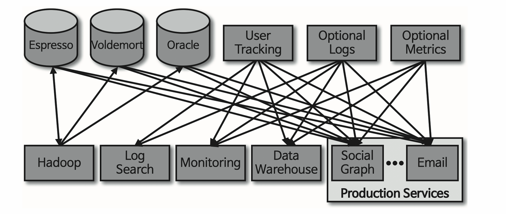
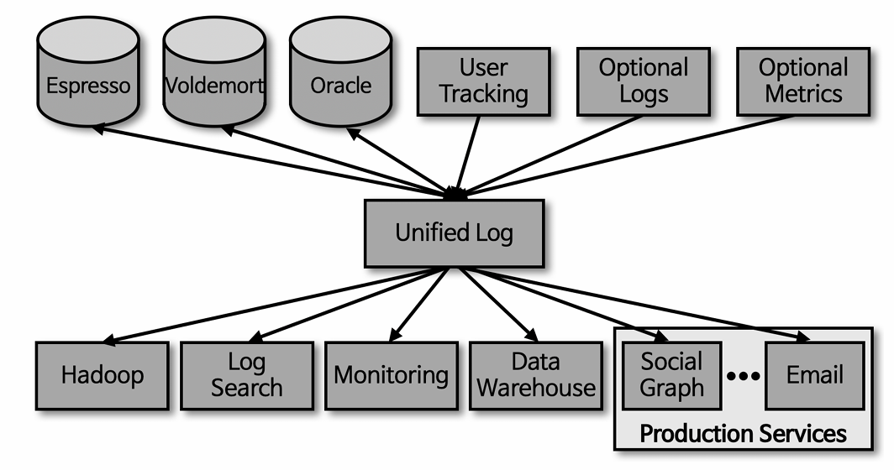
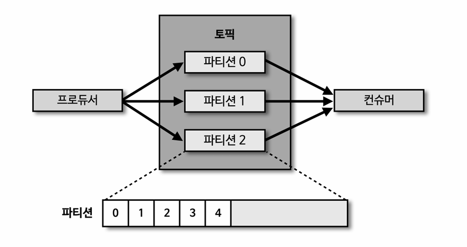
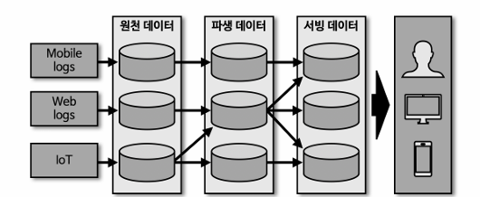
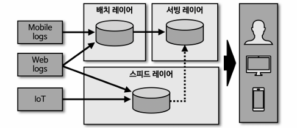
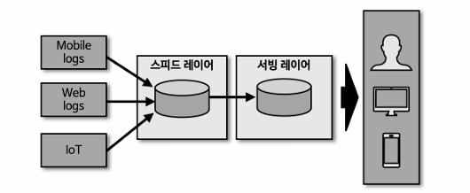
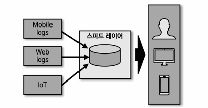
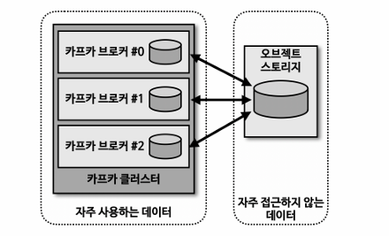

## 개요
소셜 네트워크 사이트인 '링크드인' 에서는 파편화된 데이터 수집 및 분배 아키텍처를 운영하는 데에 어려움을 겪었다.
데이터를 생성하고 적재하기 위해서는 데이터를 생성하는 소스 App 과 데이터가 최종 적재되는 타겟 App 을 연결해야 한다.
초기 운영 시에는 단방향 통신을 통해 소스 -> 타겟 App 으로 연동하는 소스코드를 작성했고 아키텍처가 복잡하지 않았으므로 운영히 힘들지 않았다.
그러나 시간이 지날수록 아키텍처는 거대해졌고 데이터를 전송하는 라인이 기하급수적으로 복잡해지기 시작했다.

그러면서 하나의 App 에서 발생하는 장애가 전파되는 문제점 등이 발생했고
이를 해결하기 위해 링크드인 데이터팀에서는 기존에 나와 있던 각종 상용 데이터 프레임워크와 오픈소스를 아키텍처에 녹여내어 데이터 파이프라인의 파편화를 개선하려고 했다.
다양한 메시징 플랫폼과 ETL(Extract Transform Load) 툴을 적용하여 아키텍처를 변경하려고 노력했지만 파편화된 데이터 파이프라인의 복잡도를 낮춰주는 아키텍처가 되지는 못했다.

결국 링크드인의 데이터팀은 신규 시스템을 만들기로 결정했고 그 결과물이 아파치 카프카다.
링크드인의 내부 데이터 흐름을 개선하기 위해 개발한 카프카는 매우 훌륭하게 동작했다.
카프카는 각각의 애플리케이션끼리 연결하여 데이터를 처리하는 것이 아니라 한 곳에 모아 처리할 수 있도록 중앙집중화했다.

기존에 1:1 매칭으로 개발하고 운영하던 데이터 파이프라인은 커플링으로 인해 한쪽의 이슈가 다른 한쪽의 애플리케이션에 영향을 미치곤 했지만,
카프카는 이러한 의존도를 타파하였다.
이제 소스 애플리케이션에서 생성되는 데이터는 어느 타깃 애플리케이션으로 보낼 것인지 고민하지 않고 일단 카프카로 넣으면 된다.
카프카 내부에 데이터가 저장되는 파티션의 동작은 FIFO(First In First Out) 방식의 큐 자료구조와 유사하다.
큐에 데이터를 보내는 것이 '프로듀서' 이고 큐에서 데이터를 가져가는 것이 '컨슈머'다

## 빅데이터 파이프라인에 적합한 카프카의 특징
### 1. 처리량
카프카는 프로듀서가 브로커로 데이터를 보낼 때와 컨슈머가 브로커로부터 데이터를 받을 때 모두 묶어서 전송한다.
많은 양의 데이터를 보낼 때 발생하는 네트워크 비용은 무시할 수 없다.
동일한 양의 데이터를 보낼 때 네트워크 통신 횟수를 최소한으로 줄인다면 동일한 시간 동안 더 많은 데이터를 처리할 수 있게 된다. 
카프카는 많은 양의 데이터를 배치로 처리할 수 있기 때문에 대용량 데이터를 처리하는데 적합하다.
또한 파티션 단위를 통해 동일 목적의 데이터를 여러 파티션에 분배하고 데이터를 병렬 처리할 수 있다. 
파티션 개수만큼 컨슈머를 늘려서 동일 시간당 처리량을 늘리는 것이다.

### 2. 확장성
데이터 파이프라인에서 데이터를 모을 때 데이터량을 예측하기 어렵다.
카프카는 가변적인 환경에서 안정적으로 확장 가능하도록 설계되었다.
데이터량이 적을 때는 카프카 클러스터의 브로커 개수를 최소한으로 사용하고, 
데이터량이 많을 때는 자연스럽게 브로커 개수를 확장하는 방식으로 스케일 인과 스케일 아웃이 가능하다.
클러스터는 이 과정을 무중단으로 지원하기 때문에 365일 24시간 업무를 처리해야 하는 커머스나 은행 같은 비즈니스 모델에서도 안정적으로 운영이 가능하다. 

### 3. 영속성
영속성이란 데이터를 생성한 프로그램이 종료되더라도 사라지지 않는 데이터의 속성을 뜻한다.
카프카는 다른 메시징 플랫폼과 다르게 전송받은 데이터를 메모리에 저장하지 않고 파일 시스템에 저장한다.
파일 시스템에 데이터를 적재하고 사용하는 것은 보편적으로 느리다고 생각하겠지만,
카프카는 운영체제 레벨에서 파일 시스템을 최대한 활용하는 방법을 적용하였다.
운영체제에서는 파일 I/O 성능 향상을 위해 페이지 캐시 영역을 메모리에 따로 생성하여 사용한다.
페이지 캐시 메모리 영역을 사용하여 한번 읽은 파일 내용은 메모리에 저장시켰다가 다시 사용하는 방식이기 때문에 카프카가 파일 시스템에 저장하고 데이터를 저장 및 전송하더라도 처리량이 높은 것이다.
디스크 기반의 파일 시스템을 활용한 덕분에 브로커 애플리케이션이 장애 발생으로 인해 급작스럽게 종료되더라도
프로세스를 재시작하여 안전하게 데이터를 다시 처리할 수 있다.

### 4. 고가용성
3개 이상의 서버들로 운영되는 카프카 클러스터는 일부 서버에 장애가 발생하더라도 무중단으로 안전하고 지속적으로 데이터를 처리할 수 있다.
클러스터로 이루어진 카프카는 데이터의 복제를 통해 고가용성의 특징을 가지게 되었다.
프로듀서로 전송받은 데이터를 여러 브로커 중 1대의 브로커에만 저장하는 것이 아니라 또 다른 브로커에도 저장하는 것이다.
한 브로커에 장애가 발생하더라도 복제된 데이터가 나머지 브로커에 저장되어 있으므로 저장 된 데이터를 기준으로 지속적으로 데이터 처리가 가능한 것이다.

## 빅데이터 아키텍처 종류와 카프카의 미래
### 1. 초기 빅데이터 플랫폼

### 2. 람다 아키텍처

### 3. 카파 아키텍처

### 4. 카프카의 미래(스트리밍 데이터 레이크)

